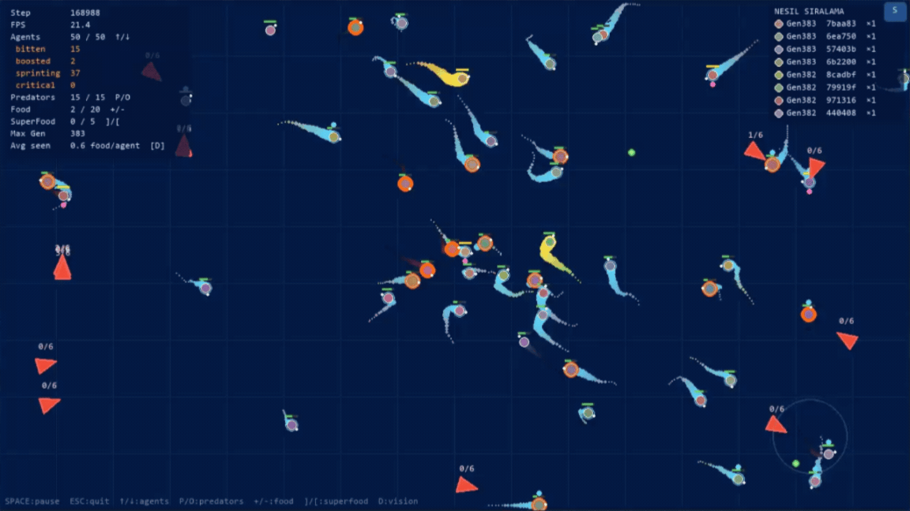

# The Aquarium — Neural Selection Simulator

A real-time natural selection simulation where fish agents evolve their own neural networks through survival, reproduction, and genetic inheritance — all rendered live with pygame.

---

## Demo

<!-- video -->

<!-- Replace the URL above with your uploaded video asset link -->

---

## What Is This?

Every fish in the tank is controlled by a small neural network. No rules are hard-coded for how to find food or escape predators — the fish learn entirely through evolution. Agents that survive longer, eat more, and reproduce more pass their weights to offspring. Over generations, increasingly complex behaviours emerge: foraging routes, predator evasion, flocking, mating signals, and sprint bursts.

---

## Features

### Evolution & Genetics
- **Neural network brains** — 34-input → 32 → 16 → 2-output fully-connected network with tanh activations; weights encoded as a flat genome
- **Uniform crossover** — two parents contribute genes randomly; the blend ratio determines the offspring's colour
- **Gaussian mutation** — each generation explores small random variations
- **Cross-lineage mating only** — fish cannot breed with their own colour family, enforcing genetic diversity
- **Generation tracking** — lineage leaderboard sorted by maximum generation reached

### Perception (34 inputs per fish)
| Channel | Dims | Description |
|---|---|---|
| 3 nearest food items | 9 | distance, sin(θ), cos(θ) each |
| 2 nearest predators | 6 | distance, sin(θ), cos(θ) each |
| 3 nearest agents | 12 | distance, sin(θ), cos(θ), **can\_reproduce** flag each |
| Wall distances | 4 | left, right, top, bottom (normalised) |
| Own velocity | 2 | vx / max\_speed, vy / max\_speed |
| Own energy | 1 | energy / 200 clamped to [0,1] |

### Agent Behaviours
- **Foraging** — move toward food and super food
- **Predator avoidance** — 2-hit kill system; first bite costs heavy energy, second is fatal
- **Danger signal** — when a predator is nearby the fish broadcasts a wave ring; neighbours receive a rule-based velocity nudge away from the threat
- **Mating signal** — reproduction-ready fish pulse a magenta indicator; readiness is encoded in perception so the neural network can learn to seek mates
- **Voluntary sprint** — when brain output magnitude exceeds a threshold, the fish activates 1.7× speed at extra energy cost; visible via a cyan trail and ring
- **Critical energy** — below the danger threshold the fish pulses red and incurs an additional energy drain penalty
- **Motion trail** — fading position history; gold tinted during super-food boost, cyan tinted during sprint

### Colour System
- Every founding lineage receives a random saturated HSV colour
- Offspring colour = **72 % parent blend** (weighted by crossover ratio) + **28 % random vivid component**  
  → children resemble their parents but remain visually distinct across generations

### Memory & Persistence
- **Auto-save** — top-10 agents by fitness saved to `saved_agents/best_agents.json` every 100 steps
- **Named agents** — pin any agent via the UI with a custom name; stored in `saved_agents/named_agents.json` and never evicted by auto-save
- **Seed-from-saved** — on next launch the population is re-seeded from saved genomes (lineage colours preserved)
- **Population recovery** — when population falls below the minimum, saved genomes are respawned with colour-varied new lineage IDs to ensure mating diversity

### Live Settings UI (`S` key)
Open the right-side panel at any time without pausing the simulation.

| Tab | Contents |
|---|---|
| **Ayarlar** | [-] / [+] sliders for food, super food, predator, and agent parameters; changes propagate instantly to all living entities |
| **Kaydedilenler** | List of saved agents (★ pinned / auto-best); Spawn or Delete each entry |
| **Seçili** | Left-click any fish or predator to inspect live stats; name and pin the selected agent |

### Keyboard Shortcuts
| Key | Action |
|---|---|
| `SPACE` | Pause / resume |
| `ESC` | Quit |
| `S` | Toggle settings panel |
| `D` | Debug vision (detection circles + lines to food & predators) |
| `+` / `-` | Food cap ±10 |
| `]` / `[` | Super food cap ±1 |
| `P` / `O` | Predator cap ±1 |
| `↑` / `↓` | Agent cap ±10 |

---

## Architecture

```
aquarium/
├── core/
│   ├── entity.py            # Base entity (position, alive, id)
│   ├── agent.py             # Base agent (genome, brain, fitness)
│   ├── environment.py       # Entity management, spatial queries
│   └── simulation_engine.py # Main loop, event routing
│
├── aquarium/
│   ├── fish_agent.py        # FishAgent — perception, action, wall repulsion, signals
│   ├── predator.py          # Predator — target tracking, lifetime, kill system
│   ├── food.py              # Food — drifting, energy value
│   ├── super_food.py        # SuperFood — speed boost, pulsing glow
│   └── environment.py       # AquariumEnvironment — spawning, reproduction, recovery
│
├── brain/
│   └── neural_brain.py      # PyTorch Sequential (tanh), genome ↔ weight conversion
│
├── genetics/
│   ├── genome.py            # Genome wrapper (numpy array)
│   ├── crossover.py         # Uniform / single-point crossover + blend ratio output
│   └── mutation.py          # Gaussian mutation
│
├── memory/
│   ├── agent_memory.py      # Auto-save best-N + named agent persistence
│   └── lineage_tracker.py   # Birth/death log, max-generation tracking
│
├── visualization/
│   ├── renderer.py          # Pygame renderer — trails, rings, HUD, lineage legend
│   ├── settings_panel.py    # Live settings + inspect + saved-agents UI panel
│   └── effects.py           # Wave ring effect manager
│
├── sim_logging/
│   └── sim_logger.py        # CSV logging (step, population, avg energy, …)
│
├── saved_agents/
│   ├── best_agents.json     # Auto-saved top-10 genomes
│   └── named_agents.json    # User-pinned agents (never evicted)
│
├── config.yaml              # All simulation parameters
└── main.py                  # Entry point
```

---

## Quick Start

**Requirements:** Python 3.12, `pygame`, `numpy`, `torch`, `pyyaml`

```bash
# Install dependencies
pip install pygame numpy torch pyyaml

# Run
python main.py
# or on Windows:
run.bat
```

---

## Configuration (`config.yaml`)

All parameters can be tuned either in the file (takes effect on next launch) or live via the `S` panel during simulation.

```yaml
agent:
  initial_count: 30          # starting population
  max_count: 120             # population cap
  speed: 3.0                 # base max speed (px/step)
  detection_radius: 180      # perception range
  energy_decay: 0.03         # base energy drain per step
  reproduction_threshold: 160.0
  sprint_threshold: 0.72     # brain output magnitude to trigger sprint
  sprint_multiplier: 1.7
  critical_energy: 35.0      # below this = extra penalty + red glow

brain:
  input_size: 34
  hidden_sizes: [32, 16]
  output_size: 2

genetics:
  mutation_rate: 0.08
  mutation_strength: 0.12
  crossover_type: "uniform"

memory:
  save_top_n: 10
  save_interval: 100         # steps between auto-saves
```

---

## How Evolution Works

1. Random agents spawn with random genomes (or from saved best agents on restart)
2. Agents that find food survive longer → accumulate fitness
3. Two agents of **different lineages** near each other, both above the reproduction energy threshold, produce two offspring via crossover + mutation
4. Offspring inherit a blend of parent colours weighted by their genetic contribution
5. Dead agents' genomes leave the gene pool; successful strategies propagate forward
6. Every 100 steps the top agents are checkpointed; if the population crashes below the minimum it is replenished from these checkpoints with colour-varied lineage IDs
